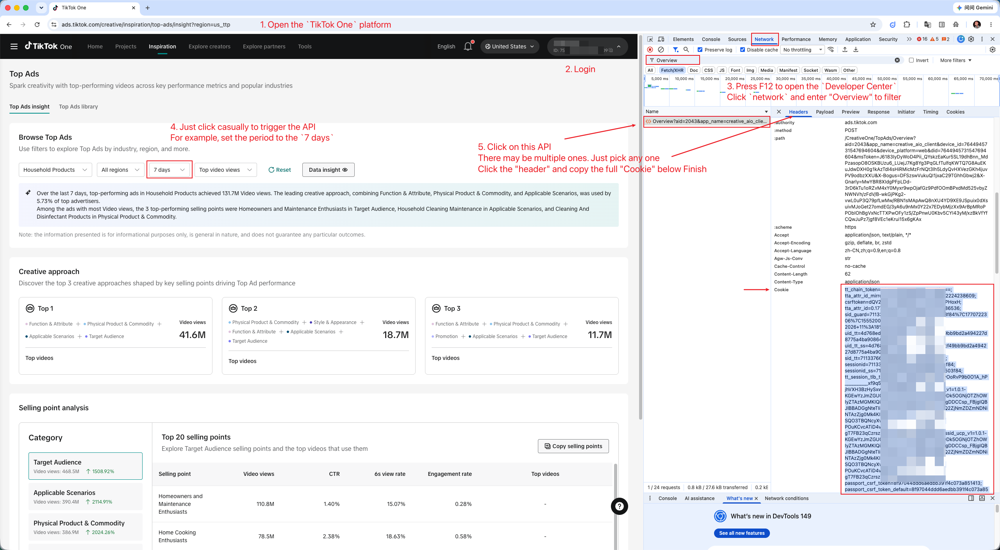

# TikTok One Scraper

[English README](https://github.com/lofe-w/tiktok-one-scraper-public/blob/main/README.md)

这是一个用于采集 TikTok One inspiration 和 insight 数据的 Apify Actor。当前版本聚焦 TikTok One 官方 Top Ads Insight 和 Top Ads Library 工作流，返回结构化 JSON，适用于广告研究、竞品监控、创意分析和营销洞察。

[Start Now (On Apify)](https://apify.com/doliz/tiktok-one-scraper)

## 核心功能

* **快速 API 采集**：直接调用 TikTok One 后端接口，避免低效的网页 UI 自动化。
* **支持 Top Ads Insight**：采集概览指标、创意方法、卖点分析、素材列表和素材详情。
* **支持 Top Ads Library**：使用官方筛选项搜索 Top Ads Library，并采集素材详情。
* **结构化 JSON 输出**：返回机器可读的 TikTok One API 数据。
* **公开选项文件**：常用筛选项发布在本仓库的 [`options/`](options/) 目录下。

## 输入配置

### 通用配置

* **Target** `target`：（必填）选择 TikTok One 数据源。

  可选值：`top_ads_insight`、`top_ads_insight_creative_approach`、`top_ads_insight_selling_point_analysis`、`top_ads_insight_top20_selling_points`、`top_ads_insight_formula_material_list`、`top_ads_insight_selling_point_material_list`、`top_ads_insight_material_detail`、`top_ads_library`、`top_ads_library_material_detail`。

* **Cookies** `cookies`：（必填）登录 TikTok One 后获取的认证 Cookie。获取方式：

  

### Top Ads Insight 配置

当 `Target` 为 `top_ads_insight` 时使用这些参数。

* **Industry label** `insight_industry_label`：（必填）官方行业标签。[Options](https://raw.githubusercontent.com/lofe-w/tiktok-one-scraper-public/refs/heads/main/options/top_ads_insight_industry.json)
* **Country code** `insight_country_code`：（必填）官方国家或地区筛选。空值表示 `All`。[Options](https://raw.githubusercontent.com/lofe-w/tiktok-one-scraper-public/refs/heads/main/options/top_ads_insight_country.json)
* **Time range** `insight_time_range`：（必填）发布时间范围。[Options](https://raw.githubusercontent.com/lofe-w/tiktok-one-scraper-public/refs/heads/main/options/top_ads_insight_time_range.json)
* **Sort by** `insight_order_field`：（必填）排序指标。[Options](https://raw.githubusercontent.com/lofe-w/tiktok-one-scraper-public/refs/heads/main/options/top_ads_insight_order_field.json)

### Top Ads Insight 单接口目标

每个 Top Ads Insight 单接口目标在 Actor 输入中都有独立的行业、国家/地区、时间范围和排序字段。

* `top_ads_insight_creative_approach`：采集创意方法公式。
* `top_ads_insight_selling_point_analysis`：采集卖点分类。
* `top_ads_insight_top20_selling_points`：需要 `insight_top20_category`，采集该分类下的卖点。
* `top_ads_insight_formula_material_list`：需要 `insight_formula_material_formula_id`，并支持 `insight_formula_material_page` 和 `insight_formula_material_limit`。
* `top_ads_insight_selling_point_material_list`：需要 `insight_selling_material_selling_point`，并支持 `insight_selling_material_page` 和 `insight_selling_material_limit`。

### Top Ads Insight - Material Detail

当 `Target` 为 `top_ads_insight_material_detail` 时使用这些参数。

* **Insight material ID** `insight_detail_material_id`：（必填）由 Top Ads Insight materials 目标返回的素材 ID。

### Top Ads Library 配置

当 `Target` 为 `top_ads_library` 时使用这些参数。

* **Industry label** `library_industry_label`：（可选）行业标签 ID。留空表示全部行业。[Options](https://raw.githubusercontent.com/lofe-w/tiktok-one-scraper-public/refs/heads/main/options/top_ads_library_industry.json)
* **Country code** `library_country_code`：（可选）国家或地区代码。留空表示全部国家/地区。[Options](https://raw.githubusercontent.com/lofe-w/tiktok-one-scraper-public/refs/heads/main/options/top_ads_library_country.json)
* **Time range** `library_time_range`：（必填）发布时间范围。[Options](https://raw.githubusercontent.com/lofe-w/tiktok-one-scraper-public/refs/heads/main/options/top_ads_library_time_range.json)
* **Search word** `library_search_word`：（可选）按品牌、产品或创意关键词搜索。
* **Objective** `library_objective`：（可选）广告目标。留空表示全部目标。[Options](https://raw.githubusercontent.com/lofe-w/tiktok-one-scraper-public/refs/heads/main/options/top_ads_library_objective.json)
* **Likes percentile** `library_like_cnt_filter`：（可选）点赞数分位筛选。留空表示全部分位。[Options](https://raw.githubusercontent.com/lofe-w/tiktok-one-scraper-public/refs/heads/main/options/top_ads_library_like_cnt_filter.json)
* **Sort by** `library_order_field`：（必填）结果排序指标。[Options](https://raw.githubusercontent.com/lofe-w/tiktok-one-scraper-public/refs/heads/main/options/top_ads_library_order_field.json)
* **Page** `library_page`：（必填）页码。
* **Limit** `library_limit`：（必填）每页返回数量。

### Top Ads Library - Material Detail

当 `Target` 为 `top_ads_library_material_detail` 时使用这些参数。

* **Material ID** `library_material_id`：（必填）由 `top_ads_library` 返回的素材 ID。

## Targets

| Target | 说明 | 计费 |
| --- | --- | --- |
| `top_ads_insight` | 采集 Top Ads Insight 初始页面数据：概览、创意方法、分类，以及前几个分类下的卖点行。 | 0.002$ / fetched item |
| `top_ads_insight_creative_approach` | 采集创意方法公式。 | 0.002$ / item |
| `top_ads_insight_selling_point_analysis` | 采集卖点分类。 | 0.002$ / item |
| `top_ads_insight_top20_selling_points` | 采集指定分类下的卖点。 | 0.002$ / item |
| `top_ads_insight_formula_material_list` | 按公式采集 Top Ads Insight 素材列表。 | 0.002$ / item |
| `top_ads_insight_selling_point_material_list` | 按卖点采集 Top Ads Insight 素材列表。 | 0.002$ / item |
| `top_ads_insight_material_detail` | 采集单个 Top Ads Insight 素材详情。 | 0.002$ / time |
| `top_ads_library` | 使用官方筛选项搜索 Top Ads Library 素材。 | 0.002$ / item |
| `top_ads_library_material_detail` | 采集单个 Top Ads Library 素材详情。 | 0.002$ / time |

## 说明

TikTok One 请求需要来自 `ads.tiktok.com` 的有效登录 Cookie。如果 Cookie 缺失、无效、过期，或被 TikTok 限流，上游请求可能失败或返回认证错误。

本公开仓库只包含面向用户的文档、图片和选项文件。Apify Actor 运行时代码保存在私有 Actor 仓库中。
